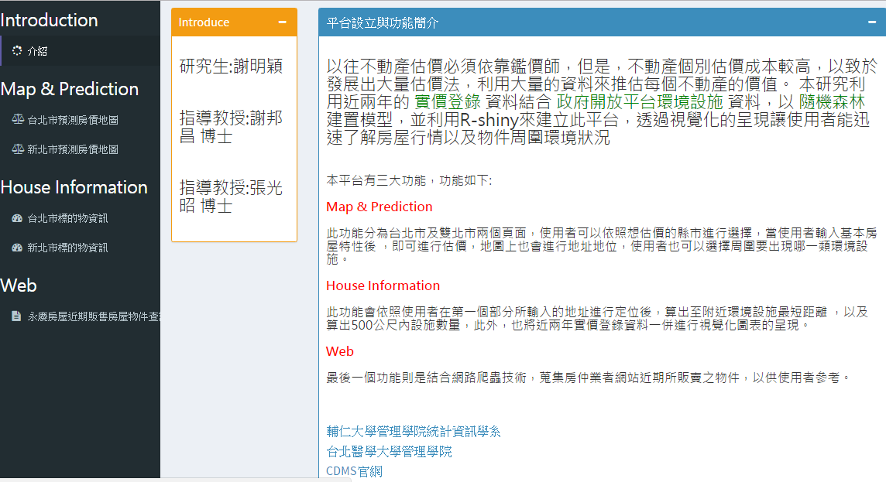
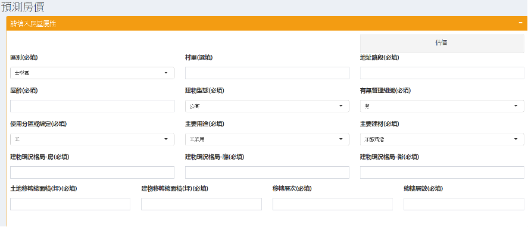
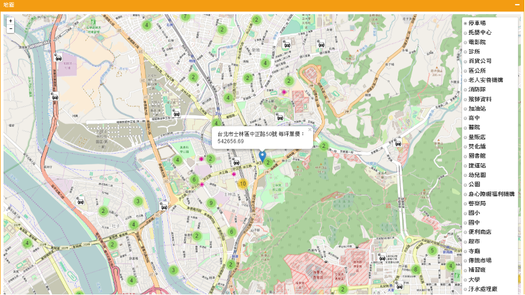
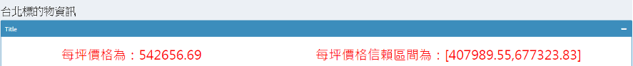
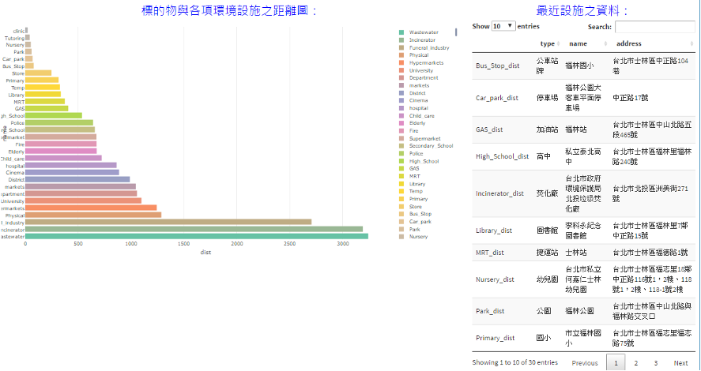
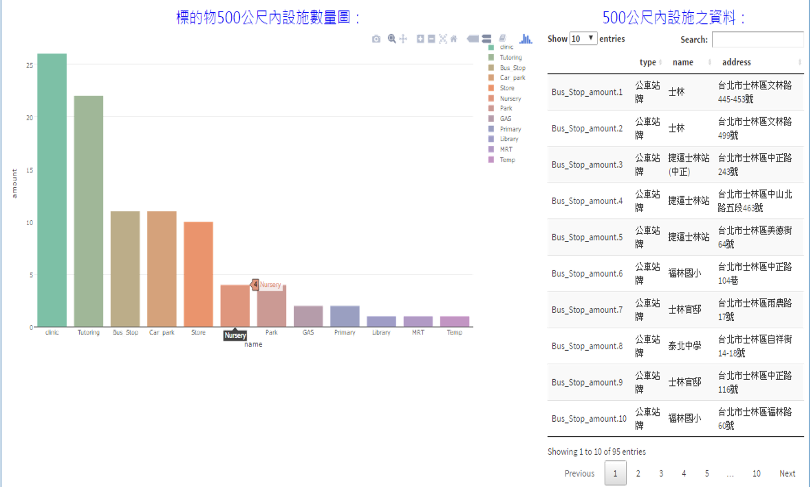
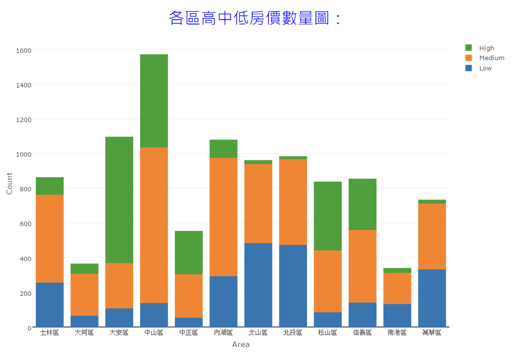
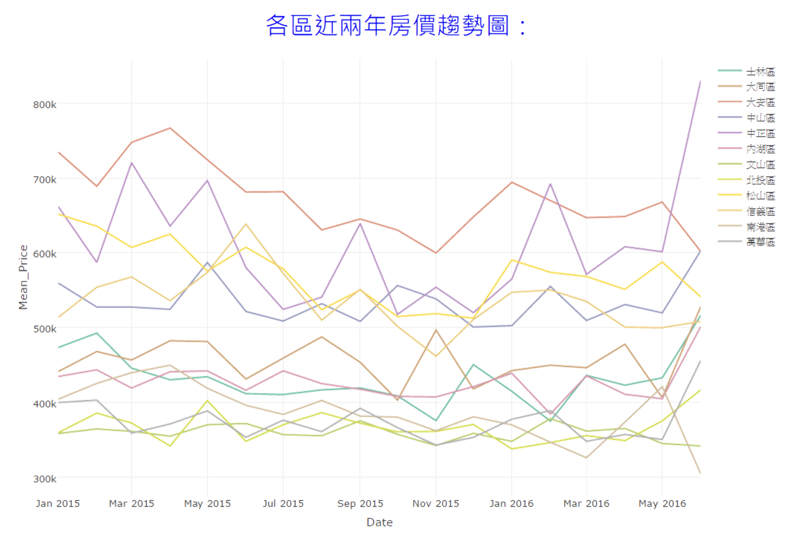
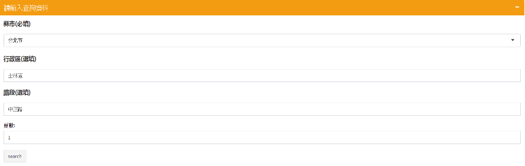
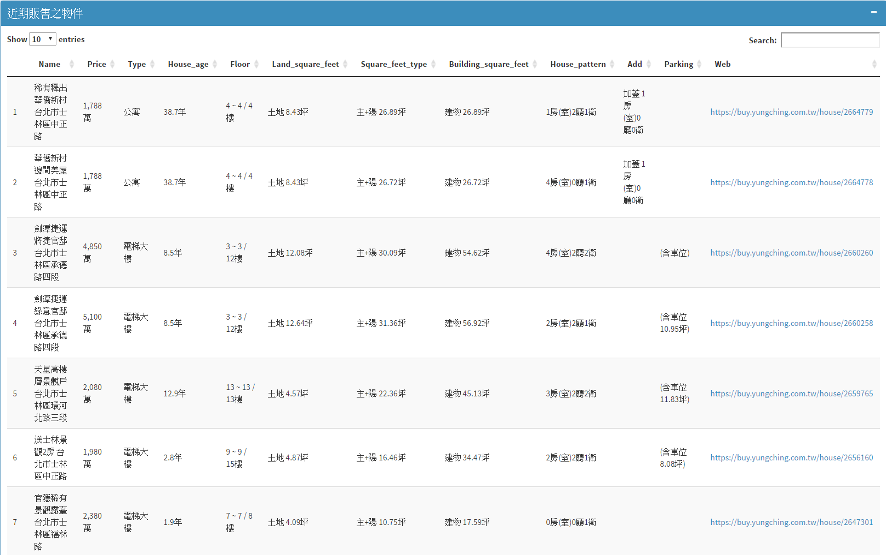

# 房價預測視覺化平台
`本研究所建置之平台可分為三個部分，第一個部分為介紹，第二個部分為地圖定位及預測房價，第三個部分物件周邊資訊為第二部分的延伸，將使用者周遭環境因子現況做視覺化呈現，其中，第二部份及及第三部分皆分為台北市及新北市可供使用者選擇，第四部份則是蒐集不動產房仲網近期販售房屋物件將其整理為資料表給使用者參考，以下介紹以台北市做為範例。`

## (一) 平台介紹：
`此分頁向使用者解說每個頁面所提供之功能，如圖1:`

圖1 平台介紹

## (二) 地圖定位及房價預測：
`此分頁又分為上半部及下半部，如圖2-1 為上半部分，主要是讓使用者填寫想進行估價之房屋物件基本資料，填寫完畢後點及右上角估價的按鈕，系統將會以使用者所填寫之房屋資料以及進行地址定位，並且在此分頁下半部回傳系統估價之結果，如圖2-2，使用者可以得知大概房價以及可以點選右方設施清單，選擇要呈現哪種周遭設施。`

圖2-1 房價預測屬性填寫

圖2-2 地址定位及估價結果

## (三) 物件周邊資訊：
`在使用者填完資料後可以點擊左方的標的物資訊，分別會呈現出標的物之價格以及信賴區間，如圖3-1。以及標的物與各項設施視覺化圖表，左方圖的部分使用者若只想知道某幾個設施可以將其餘設施做點擊進行取消顯示，右邊則是將距離最近之設施資料整理呈現，如圖3-2。再來則是顯示標的物半徑五百公尺內各設施之數量，左方以圖做呈現，右方則是將半徑五百公尺內設施資料整理呈現，如圖3-3。另外，本研究將台北市整體房價做為標準，將其分為高、中、 低三種房價後，每個行政區再以上述區分標準，分別進行計數，顯示近兩年每個行政區賣出物件之高中低價格數量，如圖3-4。最後，本研究將各區近兩年平均房價以折線圖表示，以觀察各行政區房屋價格趨勢，如圖3-5。`

圖3-1 標的物價格與信賴區間

圖3-2 標的物與各項設施之距離及設施資料

圖3-3 標的物半徑五百公尺各項設施之數量及設施資料

圖3-4 各區高中低房價數量圖

圖3-5 各區近兩年房價趨勢圖

## (四) 近期販售房屋資訊：
`在使用者得知系統預測之價格後，本研究利用網路爬蟲技術，將房仲業者網站之近期販售物件與平台做結合，讓使用者輸入縣市、行政區、路段及頁數，如圖4-1，透過使用者輸入之資訊，迅速將資料做整合以供參考，並提供網址超連結的服務，可直接連結到房仲業者販售此物件之網頁，如圖4-2。`

圖4-1 填寫查詢資料區

圖4-2 近期販售物件資料

